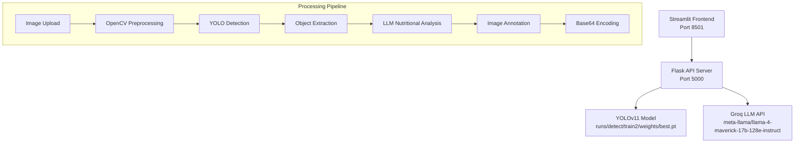
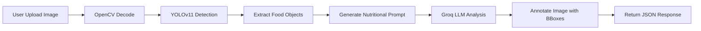

# Arsitektur Sistem Deteksi Makanan

## Overview

Sistem ini menggunakan arsitektur client-server dengan Flask API backend dan Streamlit frontend untuk deteksi makanan Indonesia menggunakan YOLOv11 dan analisis gizi dengan LLM.

## Komponen Sistem



## Alur Kerja Sistem

### 1. Image Processing Pipeline



### 2. Data Flow Architecture

- **Input**: Image file (JPG/PNG) dari Streamlit frontend
- **Processing**: OpenCV preprocessing → YOLO detection → LLM analysis
- **Output**: JSON dengan deteksi objek, gambar yang di-annotate, dan analisis gizi

## Dependencies dan Requirements

### Backend Dependencies

```python
ultralytics==8.0.196  # YOLOv11
flask==2.3.3          # Web framework
flask-cors==4.0.0     # CORS support
opencv-python==4.8.1  # Image processing
numpy==1.24.3         # Numerical operations
requests==2.31.0      # HTTP client untuk Groq API
```

### Model Requirements

- **Model Path**: `runs/detect/train2/weights/best.pt`
- **Classes**: 29 jenis makanan Indonesia
- **Input Size**: 224x224 pixels
- **Format**: YOLOv11 weights

## API Endpoints

### POST /detect-gizi

**Request**: Multipart form dengan image file
**Response**: JSON dengan struktur:

```json
{
  "objects": [
    {
      "nama": "nasi goreng",
      "confidence": 0.95,
      "bbox": [x1, y1, x2, y2]
    }
  ],
  "image": "data:image/jpeg;base64,...",
  "gizi": "Tabel informasi gizi dalam bahasa Indonesia"
}
```

## Konfigurasi

### Environment Variables (Recommended)

```bash
GROQ_API_KEY=your_api_key_here
MODEL_PATH=runs/detect/train2/weights/best.pt
FLASK_HOST=0.0.0.0
FLASK_PORT=5000
```

### Hardcoded Configuration (Current)

- **Groq API Key**: `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`
- **Model**: `meta-llama/llama-4-maverick-17b-128e-instruct`
- **Timeout**: 30 detik untuk LLM call
- **Temperature**: 0.7 untuk response variation

## Performance Considerations

### Bottlenecks

1. **LLM API Call**: Tergantung pada latency Groq API
2. **Model Loading**: YOLO model loaded once on startup
3. **Image Processing**: Full image processing in memory

### Optimizations

- Model loaded once dan shared across requests
- Image processing menggunakan OpenCV (lebih cepat dari PIL)
- Base64 encoding untuk efficient image transfer

## Error Handling Scenarios

### Common Issues

1. **Model not found**: Path ke `best.pt` tidak ada
2. **API key invalid**: Groq API key expired atau invalid
3. **Image format error**: File bukan JPG/PNG yang valid
4. **Timeout**: LLM response melebihi 30 detik
5. **CORS issues**: Frontend tidak bisa akses API

### Fallback Strategies

- Return detection results tanpa nutritional analysis jika LLM gagal
- Client-side confidence filtering di Streamlit
- Error messages yang user-friendly

## Deployment Architecture

### Development Setup

```bash
# Terminal 1: Start API Server
python api.py

# Terminal 2: Start Frontend
streamlit run app.py
```

### Production Considerations

- **Containerization**: Docker untuk consistency
- **Load Balancing**: Multiple Flask instances untuk scalability
- **Model Versioning**: Semantic versioning untuk model updates
- **Monitoring**: Health checks dan performance metrics
