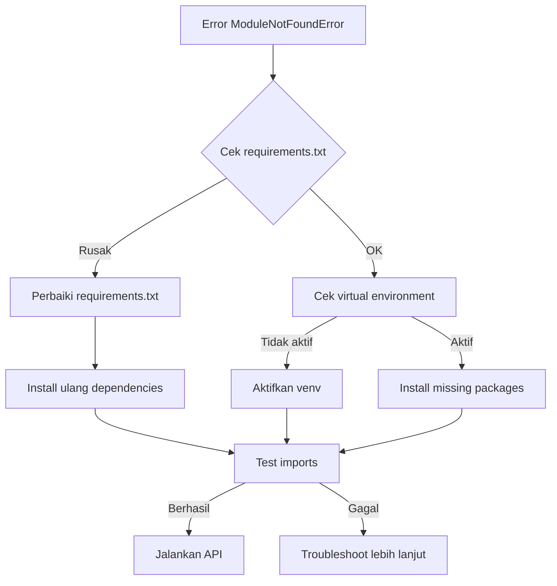

# Solusi Error API Food Detection

## Masalah Utama

Error `ModuleNotFoundError: No module named 'ultralytics'` terjadi karena file `requirements.txt` rusak dan package dependencies tidak terinstall dengan benar.

## Penyebab Masalah

1. **File requirements.txt rusak** - format mengandung karakter aneh
2. **Missing dependencies** - Flask dan flask-cors tidak ada
3. **Package tidak terinstall** - ultralytics dan dependencies lainnya

## Solusi Lengkap

### 1. Perbaiki File requirements.txt

Hapus file requirements.txt yang lama dan buat baru dengan konten berikut:

```txt
# Core ML/DL Libraries
torch==2.9.0
torchvision==0.24.0
ultralytics==8.3.225
ultralytics-thop==2.0.18

# Image Processing
opencv-python==4.12.0.88
pillow==12.0.0

# Data Processing
numpy==2.2.6
pandas==2.2.6

# Web Framework
flask==3.1.6
flask-cors==5.0.1

# HTTP Requests
requests==2.32.5

# Jupyter Notebook Support
jupyter==1.1.1
jupyter-client==8.6.3
jupyter-core==5.9.1
ipython==9.7.0
ipykernel==7.1.0

# Visualization
matplotlib==3.10.7
seaborn==0.13.2

# Utilities
PyYAML==6.0.3
tqdm==4.67.1
```

### 2. Commands untuk Instalasi

#### Install Dependencies

```bash
# Hapus virtual environment lama (jika ada)
deactivate
rm -rf venv

# Buat virtual environment baru
python -m venv venv

# Aktifkan virtual environment
# Windows:
venv\Scripts\activate
# Linux/Mac:
source venv/bin/activate

# Upgrade pip
python -m venv venv

# Install dependencies
pip install -r requirements.txt
```

#### Install YOLOv8 secara manual (jika diperlukan)

```bash
pip install ultralytics
```

### 3. Testing Instalasi

Buat file test.py untuk verifikasi:

```python
# test.py
print("Testing imports...")

try:
    import ultralytics
    print("✅ ultralytics imported successfully")
except ImportError as e:
    print(f"❌ ultralytics import failed: {e}")

try:
    from ultralytics import YOLO
    print("✅ YOLO imported successfully")
except ImportError as e:
    print(f"❌ YOLO import failed: {e}")

try:
    import flask
    print("✅ flask imported successfully")
except ImportError as e:
    print(f"❌ flask import failed: {e}")

try:
    import cv2
    print("✅ opencv imported successfully")
except ImportError as e:
    print(f"❌ opencv import failed: {e}")

try:
    import numpy as np
    print("✅ numpy imported successfully")
except ImportError as e:
    print(f"❌ numpy import failed: {e}")

try:
    import requests
    print("✅ requests imported successfully")
except ImportError as e:
    print(f"❌ requests import failed: {e}")

# Test model loading
try:
    model_path = "runs/detect/train2/weights/best.pt"
    if os.path.exists(model_path):
        model = YOLO(model_path)
        print("✅ YOLO model loaded successfully")
    else:
        print(f"❌ Model file not found: {model_path}")
except Exception as e:
    print(f"❌ Model loading failed: {e}")

print("\nTesting completed!")
```

Jalankan test:

```bash
python test.py
```

### 4. Menjalankan API

#### Method 1: Jupyter Notebook

```bash
# Pastikan virtual environment aktif
jupyter notebook
# Buka api.ipynb dan run semua cells
```

#### Method 2: Convert ke .py file

```bash
# Konversi notebook ke python file
jupyter nbconvert --to python api.ipynb

# Jalankan sebagai script
python api.py
```

### 5. Troubleshooting

#### Jika error tetap terjadi:

1. **Cek Python version**: Gunakan Python 3.8-3.11
2. **Cek CUDA availability**: Jika menggunakan GPU
3. **Install ulang dependencies**:
   ```bash
   pip uninstall ultralytics -y
   pip install ultralytics
   ```

#### Error umum dan solusi:

- **CUDA out of memory**: Kurangi batch size atau gunakan CPU
- **Model not found**: Pastikan path ke best.pt benar
- **Port 5000 used**: Ubah port di `app.run(host="0.0.0.0", port=5001)`

### 6. Verifikasi API

Test API dengan curl:

```bash
# Test endpoint
curl -X GET http://localhost:5000/

# Test detection endpoint
curl -X POST -F "image=@test_image.jpg" http://localhost:5000/detect-gizi
```

### 7. Environment Variables (Production)

Untuk production, gunakan environment variables:

```python
import os
from dotenv import load_dotenv

load_dotenv()

KEY = os.getenv("GROQ_API_KEY")
MODEL = os.getenv("GROQ_MODEL", "meta-llama/llama-4-maverick-17b-128e-instruct")
```

Buat file .env:

```env
GROQ_API_KEY=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
GROQ_MODEL=meta-llama/llama-4-maverick-17b-128e-instruct
```

## Quick Fix Commands

```bash
# Satu baris install semua dependencies
pip install torch torchvision ultralytics flask flask-cors opencv-python numpy requests jupyter

# Test langsung
python -c "from ultralytics import YOLO; print('YOLO imported successfully')"
```

## Checklist Sebelum Menjalankan

- [ ] Virtual environment aktif
- [ ] Semua dependencies terinstall
- [ ] Model file `best.pt` ada di path yang benar
- [ ] Groq API key valid
- [ ] Port 5000 available
- [ ] Test image tersedia untuk testing

## Flowchart Solusi



Ikuti langkah-langkah ini secara berurutan untuk memperbaiki error API Anda.
